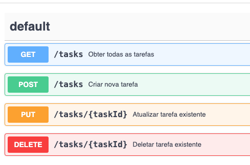

# API de Todo List no Framework Flask do Python
API criada para criação de CRUD gestão de tarefas usando Python + Flask 

 
## Requisitos 
Para utilizar este app é necessário ter o python instalado.
https://www.python.org/

# Instalação
Execute o comando: 
```bash
pip3 install -r requirements.txt
```

# Rotas
